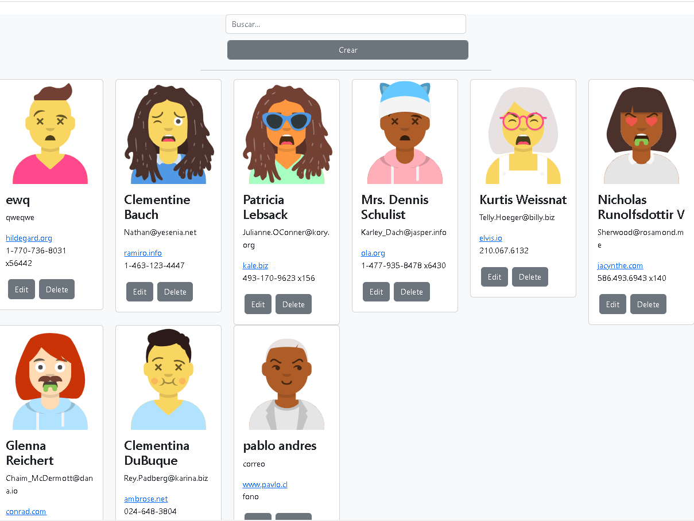
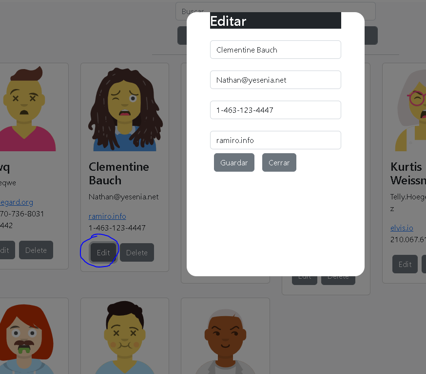
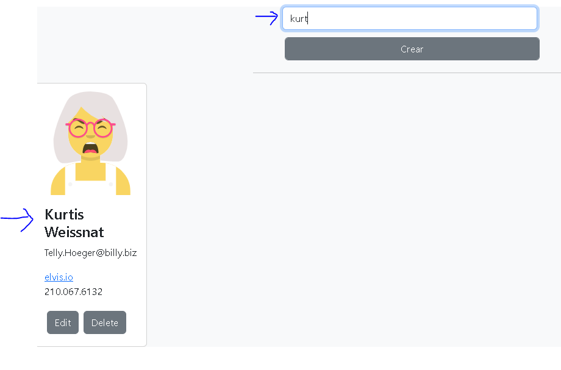
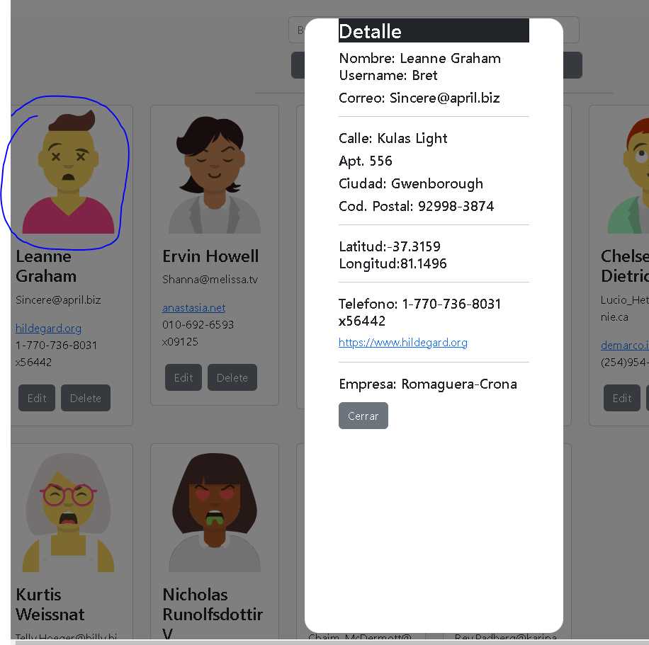

# crud-users-cards

Ejemplo desarrollado con react, bootstrap, fetch, useContext, buscar online<br>
Api de pruebas https://jsonplaceholder.typicode.com/users<br>

## Publicación
[react-task-bootstrap](https://inosttroza.github.io/react-task/)

## Instalación
Para ejecutar este proyecto, ejecute localmente usando npm:

```
$ npm install
$ npm run start
```






